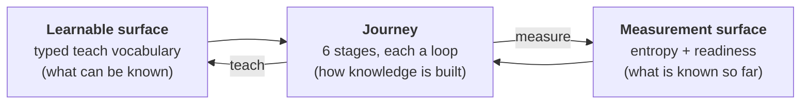
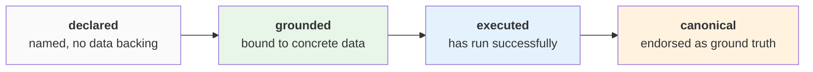
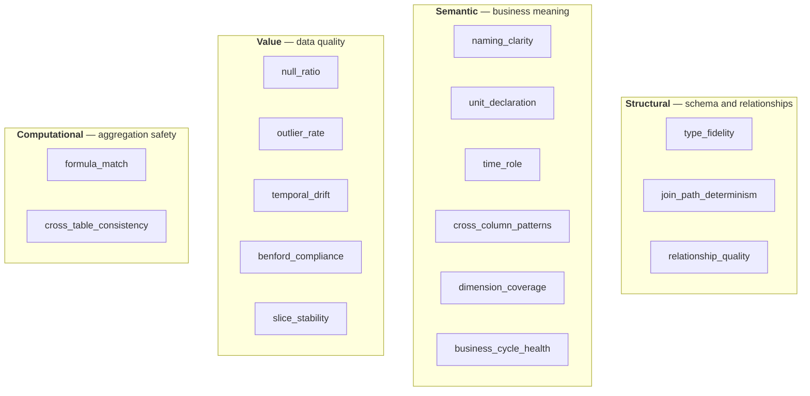
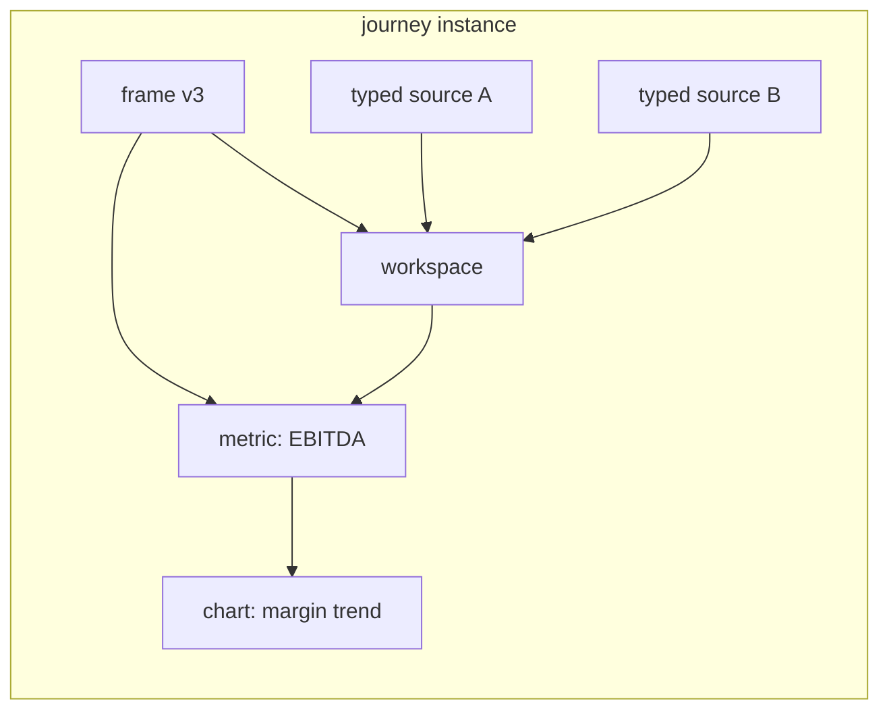
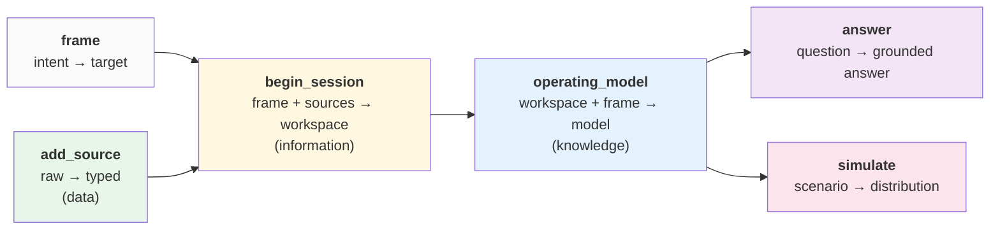
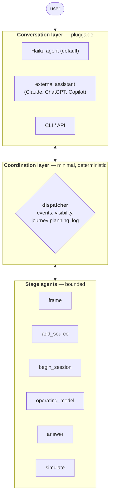

# Architecture

*dataraum — target architecture, May 2026*

---

## Overview

dataraum makes a company's data legible to an LLM. Not by indexing schemas, not by certifying a catalog — by running an agent that learns the business from its data, one stage at a time, against a measurable signal.

The system has three layers:

- A **learnable surface** — the small, typed vocabulary of things that can be known about a business, with a four-state lifecycle.
- A **measurement surface** — entropy, measured at column, relationship, and table granularity, reported as readiness.
- A **journey** — six stages a user walks through, each driven by its own agent, each producing an artifact the next stage builds on.

Each stage runs a while-loop. The agent has a bounded tool surface and a bounded view of the world. Inside the loop, the agent converges against entropy at the active strictness. The loop reports state; the user decides journey-level advancement. Knowledge accumulates as a provenance graph.

This is what a forward-deployed agent looks like when it is delivered as software.

### Scope of this document

This document describes a target architecture. It commits to structural properties — closed teach surface, stage-isolated agents, inform-don't-block reporting, provenance as substrate — without specifying implementation, cost, or organizational workflow. The following are deliberately deferred:

- **Cost budgeting and runtime performance.** Cost shape is treated qualitatively per stage.
- **Error handling and stuck-state recovery.** What happens when an LLM API fails, when a stage cannot converge, when inputs are malformed.
- **Endorsement workflow.** Who has authority to promote artifacts to canonical, how that authority is recorded, how it transfers — UX and governance, not architecture.
- **Artifact scoping and access control.** Whether sources, workspaces, and operating models are shared across teams or kept journey-local.
- **Named strictness profiles.** Future human-facing application surfaces may expose named modes (*exploratory*, *executive dashboard*, *regulatory reporting*) for users to pick from. These are UX. The architecture commits to the underlying parameter, not to the labels.
- **Deployment shape.** Single-process, docker-compose, microservices — all compatible with the architecture, none required by it.

The architecture commits to *what is true about the system*, not to *how it is built or operated*. Operational concerns are real; this is the wrong document to settle them in.

### Data, information, knowledge

The journey's middle stages map naturally to the classical levels:

- **add_source** produces typed sources — *data* with form imposed.
- **begin_session** produces analytical workspaces — *information*, data in relation with structure.
- **operating_model** produces executable operating models — *knowledge*, information with meaning and computation attached.

`answer` and `simulate` are the application of that knowledge. `frame` precedes everything: it captures intent before any data is touched.

The mapping is offered as anchoring, not doctrine — the architecture doesn't depend on the DIKW framing, but the framing helps the reader place the stages.

---

## The learnable surface

A business is not made of physics. It is made of conventions: what a customer is, when a sale counts, how a fiscal period is bounded, what EBITDA means here. An LLM already knows the general shape of these conventions. What it does not know is how *this* company instantiates them.

The learnable surface is the set of things the system can be taught about a specific company. There are ten types. Each type has a typed parameter schema, writes to a known location, and moves through a four-state lifecycle.

| Teach type | What it encodes |
|---|---|
| **concept** | A business term and the column-name patterns that suggest it (e.g. *revenue* indicated by `revenue`, `sales`, `turnover`, excluding `cost`) |
| **metric** | A computable definition expressed as a dependency graph of extracts and formulas (e.g. EBITDA = operating_income + depreciation) |
| **validation** | A rule the data must satisfy, expressed as SQL hints and an expected outcome (e.g. fiscal-period integrity) |
| **validation_exception** | A structured carve-out of a validation rule: a scope (predicate, slice, segment) where the rule does not apply, plus the business reason (e.g. AR aging > 90 days excluded for enterprise customer segment with 120-day terms) |
| **cycle** | A business process with ordered stages and completion indicators (e.g. order-to-cash) |
| **relationship** | A confirmed join between tables, with type and cardinality |
| **type_pattern** | A regex or expression that maps raw values to a typed column |
| **null_value** | A string that means *missing* in this domain (e.g. `TBD`, `PENDING`) |
| **concept_property** | A patch to a column's semantic annotation (role, concept, unit) |
| **explanation** | Domain context attached to an entropy observation, an artifact, or a validation result, optionally with evidence SQL. Explanations annotate; they do not adjudicate — they cannot suppress observations, alter scores, or affect groundedness. |

The set is closed *for the agent in the loop*. An agent cannot invent a new kind of thing to teach; it can only fill in the types that exist. A user reviewing the agent's proposals sees the same types. The system, the agent, and the user share one vocabulary. This is the **Goodhart firewall**: the agent can only optimize against signals the closed set was designed to surface.

Adding a teach type is a deliberate architectural act, not an in-loop action. The current ten types are well-shaped for finance and operations; other domains may require first-class types that do not fit, and adding them is handled at the architecture level.

### The artifact lifecycle

A teach is not a one-shot write. Every artifact moves through four states:

- **declared.** Created from intent. Has a name and a target shape, no data backing. *"We want EBITDA."*
- **grounded.** Bound to data by a downstream stage. References concrete columns/rows/slices. *"EBITDA = operating_income + depreciation, computed from these columns of this typed source."*
- **executed.** Has produced output at least once against the data with the underlying pipeline running cleanly. *"EBITDA ran successfully against Q3 data."*
- **canonical.** Endorsed by the organization as the version it uses. *"This is the EBITDA the company uses for board reporting."*

The first three are *system states* — they describe what the system has done. The fourth is an *organizational state* — it describes the artifact's status in the company's body of knowledge.

**Operations are typed by state transition.** Each teach type exposes operations that move artifacts through the lifecycle, and each operation is restricted to specific stages. `concept.declare` is a frame operation. `concept.bind` (declared → grounded) is an add_source operation. `metric.declare` is frame; `metric.compose` (declared → grounded) and `metric.execute` (grounded → executed) are operating_model operations. `metric.endorse` (executed → canonical) is the human-authority operation handled outside any single journey. The Goodhart firewall is enforced at the operation level — each agent can only invoke the operations its stage authorizes.

**Reads prefer later states.** When the answer stage resolves a question, canonical artifacts win over executed candidates, which win over grounded. A newly-executed metric is visible but flagged as a proposed revision when a canonical version exists. Canonical artifacts are append-only with explicit supersession, not overwritten.

### Endorsement

Endorsement is the act of promoting an executed artifact to canonical. It is a structural event: it transitions an artifact's lifecycle state and creates a provenance edge recording the transition. The architecture commits to the state transition, the provenance event, and the read preference.

The *workflow* around endorsement — who has authority, how that authority is recorded, how it transfers, how it interacts with team boundaries, how the human review UI is shaped — is deferred to a separate design effort. These are UX and governance concerns and will be addressed when the agentic loops have validated as the substrate they sit on.

### Verticals

Verticals bundle teaches. A vertical is not configuration — it is a head start on the learnable surface, expressed in the same types and lifecycle states a user or an agent would produce.

- **Shipped verticals** are versioned, shared across installations. The current finance vertical includes seventeen concepts, twelve cycles, a library of metrics, and validations like fiscal-period integrity. Shipped verticals start their artifacts in the declared state.
- **Working verticals** fork the shipped vertical at the start of a customer's use. Every teach the user or the agent adds accumulates into the working vertical, advancing artifacts through the lifecycle as journeys run.

Shipped verticals are themselves generated by an agent against the teach types. The current finance vertical was produced this way — pointing a strong model at the teach surface and asking for a finance vertical's worth of declared artifacts. The vertical is itself a product of the architecture: it is what you get when the system generates content using its own vocabulary.

A vertical is loosely coupled to a business vertical in the industry sense. The long-horizon convergence is for shipped verticals to align with or import from standard industry ontologies (FIBO, GS1, SCOR), but the architecture does not depend on this.

---

## The measurement surface

Most data-quality tools answer the question *"what is wrong?"* — nulls, type errors, duplicates. Entropy answers a different question: *"how much does the system not yet understand?"*

Entropy is the only measurement primitive. There is no separate notion of "data quality" alongside it — type errors, missingness, distributional anomalies are all dimensions of entropy.

### The four layers

Structural entropy is high when types don't parse and joins are ambiguous. Semantic entropy is high when columns lack business meaning, units are undeclared, or detected cycles are incomplete. Value entropy is high when values are missing, outlying, drifting, or distributionally suspicious. Computational entropy is high when derived columns don't match their formulas or values disagree across tables.

Entropy is a scalar in the range 0.0 (deterministic, fully understood) to 1.0 (maximum uncertainty).

### Three granularities

Dimensions are scored at the granularity that fits what they measure:

- **Per-column** — type_fidelity, naming_clarity, unit_declaration, time_role, null_ratio, outlier_rate, benford_compliance, formula_match.
- **Per-relationship** — join_path_determinism, relationship_quality, cross_column_patterns, cross_table_consistency.
- **Per-table or per-workspace** — dimension_coverage, slice_stability, temporal_drift, business_cycle_health.

The layers are *kinds of uncertainty*. The dimensions within layers live at the granularity that makes them measurable. Aggregations roll up: a table's overall entropy summarizes its columns', relationships' and table-level scores.

### Readiness

Entropy scores discretize into readiness — a three-state status for each artifact:

- **ready** — entropy is below the strictness threshold across critical dimensions; the artifact is reliable.
- **investigate** — entropy is elevated on at least one dimension; the artifact is usable but has open questions worth understanding.
- **blocked** — entropy is critically high on a dimension that makes the artifact unsafe to use; downstream stages should not consume it without explicit override.

Readiness applies at every granularity: per-column, per-relationship, per-table, per-workspace.

### Strictness

How strict is "below threshold"? That is the one parameter the system needs at the start of a journey.

A user doing exploratory analysis tolerates more uncertainty than one preparing a regulatory submission. The strictness setting determines where the thresholds sit. The system does not commit to named strictness profiles in the architecture — those belong to the human-facing application surface, where users may pick named modes from a dropdown. The architecture commits only to the underlying parameter.

### Extending the surface

The teach types, entropy detectors, and granularity model of the current instance are stable. The *registries* that hold them are extensible — but extension is a different activity from use, performed out-of-band, by humans or by a specialized agent operating on the architecture itself.

Adding a teach type requires defining its parameter schema, its lifecycle operations and stage authorizations, and the entropy dimensions it should affect. Adding an entropy detector requires defining what it measures, at which granularity, and how it scores. These are deliberate acts. They keep the architecture growing without destabilizing the in-loop agents that depend on the current surface being stable. The system is *closed for use, open for evolution*.

---

## Inform, don't block

The system reports state. The user — or the agent acting on the user's behalf — decides advancement.

This is the architecture's core operational principle, and it has three consequences worth stating directly.

**Stages do not gate.** A stage's output reaching `investigate` readiness does not block the next stage. The user sees the investigation surface and decides whether to address it now or carry the uncertainty forward. Only `blocked` readiness on critical artifacts triggers an automatic refusal to advance — and even then, the refusal is surfaced as a decision the user can override with explicit acknowledgment.

**Explanations frame; they do not suppress.** An agent encountering high entropy can declare an `explanation` that adds domain context — *"this column has 70% nulls because we only track that field for enterprise customers, which are 30% of the base."* The explanation does not lower the entropy score. The 70% nulls are still 70% nulls. The system reports the same elevated value with the explanation attached as context, and the human reading the report is better equipped to decide what to do. This is the Goodhart firewall holding: words don't move scores.

**The why-look surface is the user's window into state.** The `why` operation produces structured evidence — observations from detectors, scored states (low/medium/high), causal impact estimates from a probabilistic model over the entropy graph (currently a Bayesian network), and a ranked list of teach operations that would resolve the elevated dimensions. The `look` operation surfaces the current state of an artifact or a workspace. Both inform; neither acts. The user (or the agent on their behalf) chooses what to do with the information.

The inform-don't-block discipline is what keeps the system honest in two directions at once: the agent cannot make false progress by hiding uncertainty, and the user is never forced into a corner by the system's measurements. The substrate of trust is *visibility of state*, not *correctness of automatic decisions*.

---

## Provenance

Every artifact the system produces — a typed source, a workspace, an operating model, a metric, a chart — carries explicit edges to:

- **Inputs:** the artifacts and teaches it was built from.
- **Stage:** which stage produced it, in which journey instance.
- **Strictness:** the strictness setting active when it was built.
- **Teaches applied:** which teach operations contributed, and in which lifecycle states.
- **Endorsement:** when applicable, the lifecycle transition from executed to canonical, recorded as a structural event. The workflow that produces the transition is out of scope here.

This is not a logging concern. It is structural. The artifact is incomplete without its provenance edges; the data model enforces this — you cannot write an artifact without naming its inputs.

Provenance underwrites three properties:

**Journey planning** — given a new frame, the dispatcher determines which prior stage outputs are still valid and which need to re-run. Invalidation is at stage granularity: re-entering stage K invalidates the outputs of stages K+1..6. The dispatcher does not attempt to identify which specific artifacts within a downstream stage are still salvageable — per-stage invalidation is verifiable from provenance edges alone, and because teaches persist, a stage re-run reapplies everything the user previously taught.

**Groundedness** — when the answer stage produces output, every chart and every computed number traces through provenance edges to specific artifacts in the operating model. Groundedness is computed at the *artifact* level: every output reference resolves to an executed (or canonical) artifact, or it doesn't. A graph property, not a claim-counting heuristic on narrative text.

**Reproducibility** — a journey can be replayed by re-applying its recorded teach operations against its inputs. Auditability falls out naturally: who built what, when, against what teaches.

Frames themselves are versioned artifacts in the provenance graph. You can ask *"what journey was run against frame v3?"* and get a clean answer.

---

## The journey

The journey is six stages. Each stage has one agent, one tool surface, one bounded view of the world.

The journey is not a strict chain. **frame** and **add_source** are independent upstream stages — frame produces the target operating model from intent; add_source produces typed sources from raw files; neither depends on the other. They are joined at **begin_session**. From there the journey is sequential through **operating_model**, after which **answer** and **simulate** are parallel endpoints — both read the operating model, neither is required, either can be entered repeatedly.

Typed sources accumulate in a library as data is brought in — once a source is typed and profiled, it is available to any future journey. A journey is a transient composition over persistent assets: a frame, a selection of typed sources, the downstream stages built on top.

Stages are isolated by visibility. Each agent is constructed with a read scope (which prior stage's outputs it can see) and an operation scope (which teach operations it can invoke).

### What persists, what is transient

- **Teaches persist.** Every teach operation writes to the working vertical and survives stage re-runs. Re-entering a stage means re-executing with the full current set of teaches applied.
- **Artifacts persist.** Typed sources, workspaces, operating models persist as named entries in the provenance graph.
- **Agents are stateless across journeys.** The reasoning history *inside* a stage's loop — chain-of-thought, intermediate hypotheses, partial drafts — does not survive the loop closing.

This is what makes re-entry safe. The cost of going back is the cost of re-running the affected stage; nothing the user previously taught is forgotten.

### How a stage loop closes

Each stage has two convergence layers, and they do not collapse:

- **In-loop convergence** is the agent's job. The agent iterates — measure, propose a teach, apply, re-measure — until no dimension within the stage's scope is elevated at the active strictness, or until the remaining elevated dimensions cannot be resolved by any operation in scope. That is the local stopping criterion; without it the agent would not know when to hand control back.
- **Journey-level advancement** is the user's decision. With the loop's reported state in hand — what is `ready`, what is `investigate`, what is `blocked` — the user (or the conversation-layer agent on their behalf) chooses to move on, to stay and address an open `investigate` item, or to step back.

The two layers separate cleanly: a stage can be "as converged as the agent can make it" while the user chooses to keep investigating or to advance with elevated dimensions visible. The agent stops working; the journey waits for a human signal.

### frame

Turns user intent into a typed specification of what to build.

**Reads:** the active vertical. No data. **Writes:** target operating model (declared concepts, cycles, metrics, validations) and a strictness setting.

**Loop:** the user describes what they want to understand or decide. The agent proposes a target operating model: concepts to care about, cycles to track, metrics to compute, validations to hold. The user accepts, refines, or extends. All teaches in this stage produce *declared* artifacts.

**Operations:** `concept.declare`, `cycle.declare`, `metric.declare`, `validation.declare`.

**Cost shape:** small. A few LLM turns. The user is in the loop the whole time.

### add_source

Turns a raw file into a typed, profiled, annotated source.

**Reads:** the raw file. Consults the vertical for semantic priors. May consult a frame, if present, to sharpen annotation. **Writes:** typed source artifacts; grounds declared concepts by binding them to columns.

**Loop:** import, type, profile, deduplicate, annotate semantically. Where entropy is elevated, surface `why`. The why may indicate an unparseable date format the agent should declare as `type_pattern`; a token like `TBD` that means missing and should be declared as `null_value`; a column the semantic agent could not annotate confidently and that needs a `concept_property` patch. Apply the teach, rerun, re-measure.

The semantic agent runs *inside* add_source. Types are only fully resolvable with semantic context: a column called `posted_on` containing strings like `2024-Q3` is not a date and is not a string — it is a fiscal period, and the type system needs the semantic agent to say so. add_source is not done until typing and meaning agree.

Because add_source is independent of frame, a source can be added speculatively, before any specific journey. The typed source enters the library and is available for any future frame to select.

**Operations:** `type_pattern.declare`, `null_value.declare`, `concept.bind`, `concept_property.declare`, `explanation.declare`.

**Cost shape:** statistical work dominates runtime. The LLM work is the semantic agent, scoped narrowly to per-column annotation. Small models suffice for this shape.

### begin_session

Joins frame and typed sources into an analytical workspace.

**Reads:** typed sources plus the frame's targets. **Writes:** workspace artifacts — relationships, enriched views, slicing dimensions, slice tables, drift summaries, correlations; grounds declared relationships.

**Loop:** select sources whose grounded concepts match what the frame needs. Detect relationships, identify topology, build enriched views, identify slice dimensions, materialize slice tables, run drift and correlation analyses. Where joins are ambiguous, declare and bind a `relationship`. Where entropy needs domain context, declare an `explanation`.

Note what is *not* in this stage's scope: `concept_property`. If the agent here notices a column was annotated with the wrong role in add_source, the correct action is to re-enter add_source. This preserves stage isolation.

**Scope note.** begin_session is currently scoped as one stage covering relationship detection, topology, enrichment, slicing, drift, and correlations. This is a deliberate bet that one agent with one loop can keep them coherent. If experience shows otherwise, splitting this into two stages (topology vs. enrichment) is a known evolution path.

**Operations:** `relationship.declare`, `relationship.bind`, `explanation.declare`.

**Cost shape:** the most LLM-intensive stage. Investment here pays off because operating_model and answer run cheaply against a well-built workspace.

### operating_model

Reconciles the frame's target operating model with what is actually constructible from the workspace. This is where strategy meets data.

**Reads:** the workspace and the frame. **Writes:** business cycles, validations, computable metrics; promotes each through grounded → executed.

**Loop:** for each declared cycle, bind it to workspace data and execute it. For each declared metric, compose the executable definition — extracts, formulas, output steps — and run it. For each declared validation, generate SQL and execute. Where a cycle is partial, refine the cycle definition. Where a validation fails in a way that reflects how the business actually operates — a structured carve-out, not a hand-wave — declare a `validation_exception` with scope and business reason. The exception participates in the lifecycle on its own terms: grounded against the scope it applies to, executed when the scope evaluates non-empty. It narrows the validation's effective scope; the validation's readiness reflects the post-exception data. This is not score-laundering — the exception is itself a measurable, auditable, endorsable artifact whose scope is explicit.

The reconciliation step is the heart of the stage. The frame says *"we want EBITDA, gross margin, order-to-cash health by region."* The workspace contains the data that exists. The agent's job is to make every declared item either executed against the workspace, or visibly impossible — so the user gets a clear *"the data does not support this metric"* rather than a silently wrong number.

**Operations:** `cycle.bind`, `cycle.execute`, `validation.bind`, `validation.execute`, `validation_exception.declare`, `validation_exception.bind`, `metric.compose`, `metric.execute`, `explanation.declare`.

**Cost shape:** reasoning-heavy. Compute cost is bounded by the size of the frame's declared targets, not by data volume; a frame with three metrics and two cycles converges faster than one with thirty.

The operating model is the artifact the first article was about: the operating model made executable. Concepts, cycles, validations, and metrics that previously lived in PowerPoint, in the controller's head, in tribal knowledge — now expressed as an executable graph with measurable groundedness.

### answer

Responds to questions against the operating model. This is the deterministic reporting stage.

**Reads:** the operating model, preferring canonical artifacts over executed candidates. **Writes:** answers — SQL snippets, charts, narrative — each tied through provenance to the artifacts they draw from.

**Loop:** the user asks a question. The agent resolves it against the operating model: which metric answers it, which cycle frames it, which slice narrows it. It generates SQL using `search_snippets` to find reusable patterns and `run_sql` to execute. It produces charts and narrative.

The operation surface is narrow. `explanation` captures context the user provides during an answer conversation. `metric.compose` is the snippet-promotion path — when an ad-hoc SQL snippet proves useful enough to be a first-class metric, the agent proposes promotion.

**Groundedness** is the answer-level property the architecture commits to. Every chart, every computed number, every reference resolves through provenance edges to a specific executed (or canonical) artifact, or it does not. An answer composed entirely of resolved references is fully grounded. An answer that introduces ad-hoc SQL not anchored in any artifact is partially ungrounded — and the ungrounded fragments are surfaced as such, not hidden. The narrative wraps grounded artifacts; the narrative itself is not the unit of measurement.

**Open question: answer-level correctness uncertainty.** Groundedness covers *reuse* but not *correctness*. An answer can be fully grounded and still wrong — every reference resolves, but the references chosen don't actually answer the question being asked. Capturing this is an open research area; the architecture reserves the slot but does not commit to a mechanism (see *Open questions* below).

**Operations:** `explanation.declare`, `metric.compose` (from snippet only).

**Cost shape:** the cheapest stage per interaction. The expensive work is upstream.

### simulate

Exercises the operating model under varying inputs. Explicitly optional — the system can be used end-to-end without ever entering simulate.

**Reads:** the operating model. **Writes:** scenario outputs, distributions, sensitivities. Does not modify model artifacts (operations are read-only except for `explanation.declare`).

**Loop:** the user defines a scenario — a perturbation, a distribution over uncertain values, a sequence of decisions to test. The agent runs the operating model forward under the perturbed inputs. Techniques range from what-if (single-point overrides) through Monte Carlo (sampling over input distributions) to dynamic Bayesian networks (probabilistic dependencies between cycles). The architecture does not commit to specific techniques, but the structural property holds: simulate exercises the model rather than reading it.

Coverage (does the simulation explore enough of the input space?) and stability (do repeated runs converge?) are the simulate-level concerns. Groundedness still applies: a simulation's outputs must trace through provenance to the model artifacts it perturbs.

**Operations:** `explanation.declare`.

**Cost shape:** algorithmically bounded — Monte Carlo and DBN runs scale with sample count and graph complexity, not LLM token volume. Cost-shape decisions belong inside this stage, not at the conversation layer.

---

## The dispatcher

The six stages are coordinated by two layers, separated cleanly.

**The coordination layer** is plumbing. It routes events, enforces visibility (each stage agent declares its read scope and operation scope; the dispatcher refuses operations outside the declared scope), records the journey to the provenance graph, and computes journey plans (which stages need to re-enter to satisfy a new frame). Deterministic and lightweight.

**The conversation layer** is pluggable. The default implementation is a small Haiku-tier agent exposing the six stages as tools. The same coordination layer can be driven by an external assistant over MCP, by a CLI, or by an API for automated journeys.

Stage agents themselves are *model-pluggable*. Which LLM runs inside each stage is a deployment choice; the architecture binds the harness, the visibility enforcement, the measurement surface, the lifecycle, and the typed teach operations.

### The boundary between stages

The boundary between stages is events and frozen artifacts — not shared process state. This is an architectural commitment, not a deployment hedge. Because the boundary is the event surface, deployment is a separate question: single-process is fine, service-per-stage is fine; the architecture neither requires nor precludes either.

The agent does not know about the journey. A frame agent does not know there is an add_source stage. Each agent's job is local convergence, not global orchestration. Bounded context, well-defined return values, no shared mutable state.

### Re-entry preview

Re-entering a stage cascades to all downstream stages. The user sees the cost before committing:

> *"Re-entering add_source for source X will invalidate the current workspace and operating model. begin_session and operating_model will re-run. 4 metrics will recompute, 2 cycles will re-bind. Proceed?"*

This makes going back a deliberate act with visible consequences rather than a silent reset.

---

## Open questions

Three questions are deliberately left open. Each is a measurement problem the architecture reserves a slot for and does not commit to solving here.

**Entropy validation.** How do we know the entropy model is right? The answer is empirical: an entropy detector is correct when low scores correlate with usable data, high scores correlate with real problems the user agrees need fixing, and `why`-suggested teaches actually move scores in the predicted direction. This is a validation harness for the entropy model itself, distinct from the model's use. The architecture reserves the slot.

**Answer-level correctness uncertainty.** Groundedness covers reuse, not correctness. An answer can be fully grounded and still wrong. Candidate directions: diverse-model consensus (across model families, not within one), re-derivation stability (can the SQL be re-derived from the operating model N independent times?), counterfactual stability (does the answer change when an irrelevant slice is added?), citation-path integrity (does the provenance chain actually justify the output?). Criteria for picking: it must be a measurement, not a vibe; the score must be presentable to the user without hand-waving.

**Endorsement workflow, artifact scoping, and named strictness profiles.** All three are application-surface concerns the architecture does not settle. Endorsement workflow: who has authority, how it transfers, how the review UI is shaped. Artifact scoping: whether sources, workspaces, and operating models are shared across teams or kept journey-local — the architecture commits that artifacts have scope, but does not specify access control. Named strictness profiles: future application surfaces may offer users named modes (*exploratory*, *executive dashboard*, *regulatory reporting*) as dropdown choices; the architecture commits to the underlying strictness parameter but not to the labels.

---

## How the loops converge

Four properties make the loops converge rather than wander.

**A small, typed teach surface with a typed lifecycle.** Each agent can only invoke operations its stage authorizes, and each operation moves an artifact through a known state transition. Explanations are informative-only, so an agent cannot escape elevated entropy by annotating it away; legitimate exceptions live in `validation_exception`, which is itself a measurable, endorsable artifact. This is the closed-set property at the operation level.

**Inform, don't block.** The system reports state; the user decides advancement. The agent cannot make false progress by hiding uncertainty, because uncertainty is reported the same way regardless of context. Words don't move scores. The substrate of trust is visibility of state, not correctness of automatic decisions.

**Stage isolation with persistent teaches.** A stage's output is frozen as input to the next stage. Going back cascades downstream — visibly, with a preview of cost — but teaches persist across re-runs. Nothing the user taught is lost.

**Provenance as substrate.** Every artifact carries its inputs, stage, teaches, and endorsements as explicit edges. Journey planning, groundedness, and reproducibility are graph operations against this substrate, not heuristics. The architecture's promises are checkable.

---

## What compounds

The first journey in a given working vertical at a given company is the expensive one. Every teach the user or the agent adds becomes part of the working vertical: the company's concepts, the company's cycles, the company's validations and metrics. The source library grows. The provenance graph grows. The second journey is cheaper because the surface is richer and journey planning shrinks re-entry to the stages whose inputs genuinely changed.

The work a consultant used to do — writing definitions from scratch, building the operating model from interviews, codifying business logic into spreadsheets — becomes the work the agent does once, with the human in the loop as reviewer. The consultant's cost is per-engagement. The agent's cost is per-vertical, amortized across all uses, declining over time as the vertical grows.

This is what the first article hinted at: management is artificial; its vocabulary already lives in the LLM; what the system adds is a way to ground that vocabulary in a specific company's data, measurably, one stage at a time, with the operating model as the executable artifact at the end.
